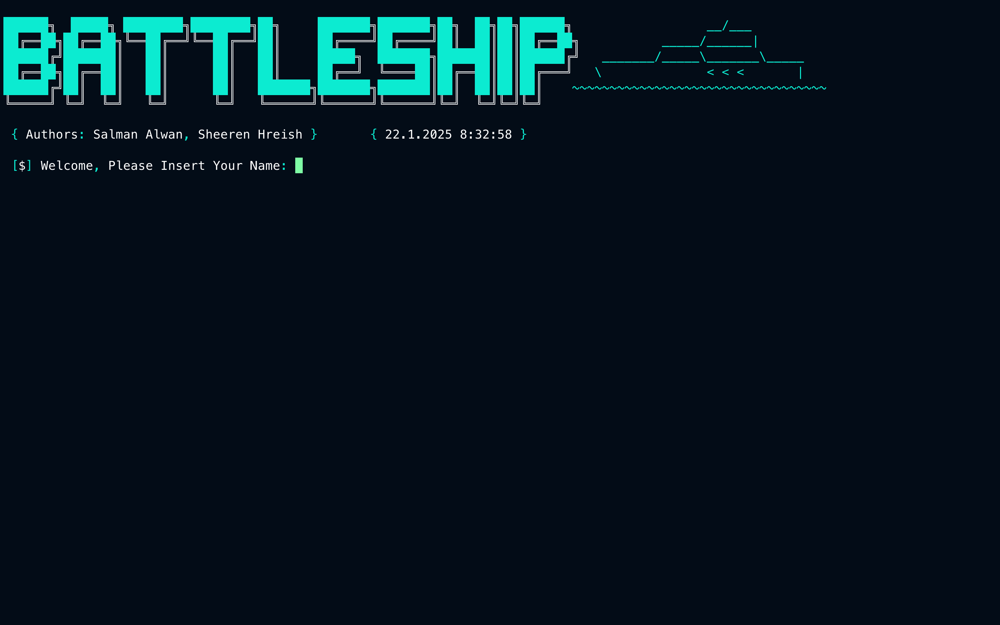

<h1 align="center">
  
  <br>
</h1>

<h4 align="center">Battleship Game in C#</h4>

<p align="center">
  <a href="#description">Description</a> •
  <a href="#installation">Installation</a> •
  <a href="#usage">Usage</a> •
  <a href="#features">Features</a> •
  <a href="#gameplay-mechanics">Gameplay Mechanics</a> •
  <a href="#license">License</a>
</p>

---

## Overview



## Description

The Battleship Game in C# is a command-line implementation of the classic naval strategy game. The program randomly places a set of ships on a 10x10 grid and challenges the player to guess the locations of these hidden ships. As the game progresses, user input is taken to mark hits and misses, and the game tracks statistics such as the number of guesses, hits, misses, and even calculates a rank (e.g., professional, expert, or noob) based on performance.

The main components of the script include:

- **Game Setup & Random Ship Placement:**  
  The game uses C#'s `Random` class to generate random positions and directions for ship placement, ensuring that ships do not touch by checking surrounding grid cells before placement.

- **User Interface & Input Handling:**  
  The command-line interface leverages the [Pastel](https://github.com/sanathp/Pastel) module for colorized text output. It accepts user coordinates (X and Y) for each guess, updates the board in real time, and handles errors like invalid inputs gracefully.

- **Gameplay Logic & Statistics:**  
  The program tracks various game statistics—such as total guesses, consecutive hits, and overall performance rank. The game rules enforce challenges like ending the game after eight consecutive misses, adding to the difficulty and replay value.

- **DLL Imports for Console Management:**  
  The code includes Windows DLL imports (from `kernel32.dll` and `user32.dll`) to control the console window size, such as maximizing it automatically for an enhanced user experience.

## Installation

1. **Clone the repository:**
   ```bash
   git clone https://github.com/SalmanAlwann/BattleShip.git
   ```
2. **Navigate to the project directory:**
   ```bash
   cd BattleShip
   ```

## Usage

To launch the Battleship game from the command line, follow these steps:

1. Open your terminal and change to the project directory.
2. Run the game using the .NET CLI:
   ```bash
   dotnet run
   ```
3. Follow the on-screen prompts to play the game. You will be asked to input the X and Y coordinates for each shot, and the game board will update to show hits and misses in real time.

## Features

- **Random Ship Placement:**  
  Ships are automatically positioned on a 10x10 grid in random locations and orientations without overlapping.

- **Real-Time Feedback:**  
  After each guess, the game instantly updates the grid to show a hit (with unique markers per ship type) or a miss, while updating the player's statistics.

- **Performance Ranking:**  
  Based on the player's performance (e.g., consecutive hits and total hits), the game assigns a performance rank such as "professional," "expert," or "noob" at the end of the match.

- **Enhanced Command-Line UI:**  
  Colorized output via the Pastel library enhances readability and overall visual appeal.

- **Robust Input Handling:**  
  The game accepts valid board coordinates (0–9) only and manages incorrect input gracefully, ensuring smooth gameplay.

## Gameplay Mechanics

- **Grid & Ships:**  
  The grid is a 10x10 matrix, and ships of varying lengths (e.g., 2, 3, 4, and 5 units) are placed randomly. Each ship type is indicated by a unique marker on the board.

- **Taking Turns:**  
  Players input X and Y coordinates to fire at their chosen spots. A hit updates the board immediately, and the game tracks whether hits are consecutive or sporadic.

- **Game Over Conditions:**  
  The game ends either when the player sinks all ships or when eight consecutive incorrect guesses are made. Final statistics and a performance ranking are then displayed.

## License

This project is open source and available under the [MIT License](LICENSE).

---

**Sources:**
- [.NET Documentation](https://docs.microsoft.com/en-us/dotnet/)
- [Pastel on GitHub](https://github.com/sanathp/Pastel)
- [GitHub Docs](https://docs.github.com/en)
